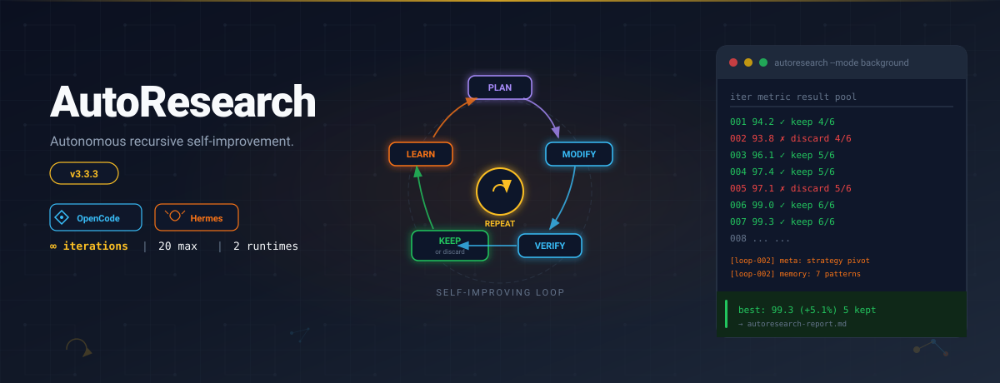
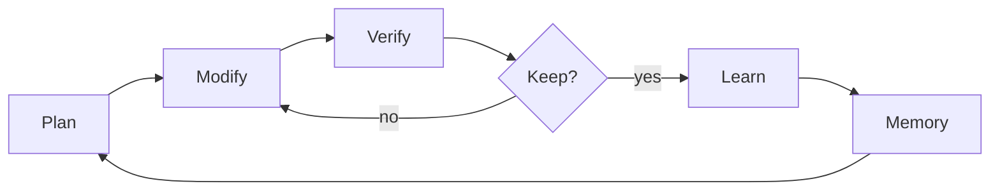
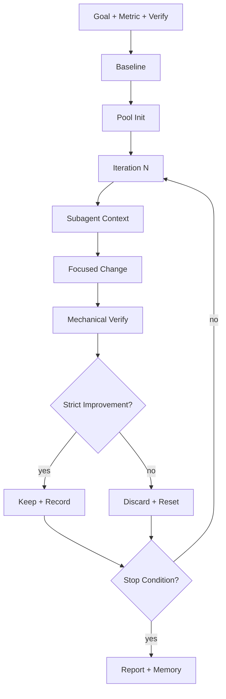
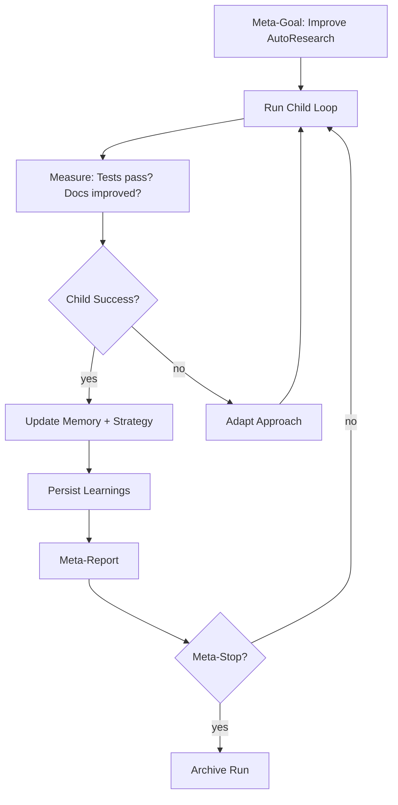
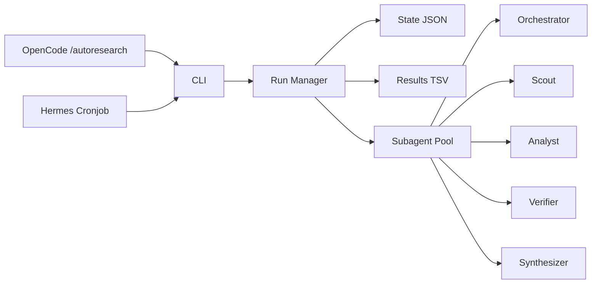

# Auto Research

<p align="center">
  
</p>

<p align="center">
  
  <a href="https://github.com/Maleick/AutoResearch/stargazers"></a>
  <a href="https://github.com/Maleick/AutoResearch/commits/main"></a>
  <a href="https://github.com/Maleick/AutoResearch/releases"></a>
  <a href="LICENSE"></a>
  <a href="https://autoresearch.teamoperator.red"></a>
</p>

<p align="center">
  <a href="https://autoresearch.teamoperator.red">Docs</a> •
  <a href="https://github.com/Maleick/AutoResearch/wiki">Wiki</a> •
  <a href="#commands">Commands</a> •
  <a href="#runtime">Runtime</a> •
  <a href="#self-improvement-loop">Self-Improvement</a>
</p>

<p align="center"><strong>Multi-runtime autonomous recursive self-improvement engine.</strong></p>

```text
┌──────────────────────────────────────────────┐
│  ITERATION MODEL        Subagent-first        │
│  ORCHESTRATION          Standing pool         │
│  VERIFICATION           Mechanical metrics    │
│  PERSISTENCE            State + Memory        │
│  META-LEARNING          Strategy adaptation   │
└──────────────────────────────────────────────┘
```

## What It Does

Auto Research is a **subagent-first autonomous iteration engine** that runs structured improve-verify loops inside **OpenCode** or **Hermes Agent**. Unlike simple task runners, it maintains a pool of specialized subagents, persists learnings across iterations, and can run recursive self-improvement loops on its own codebase.

- **Plans** experiments from a measurable goal
- **Modifies** one focused change per iteration
- **Verifies** mechanically — never on intuition alone
- **Keeps or discards** based on strict metric improvement
- **Learns** from patterns across iterations
- **Repeats** until the stop condition is met

## The Core Loop





## The Self-Improvement Loop

Auto Research can run on itself. The recursive loop adds a meta-orchestrator that:



See [`skills/autoresearch/references/self-improve-loop.md`](skills/autoresearch/references/self-improve-loop.md) for the full recursive loop specification.

## Installation

### OpenCode

For OpenCode, paste this one-line install prompt into your agent. This URL is pinned to the immutable `v3.13.1` release instructions:

```text
Fetch and follow instructions from https://raw.githubusercontent.com/Maleick/AutoResearch/refs/tags/v3.13.1/INSTALL.md
```

Recommended plugin install in `opencode.json`:

```json
{
  "plugin": ["opencode-autoresearch@latest"]
}
```

For reproducible/pinned installs, see [INSTALL.md](INSTALL.md#pinned-installation-reproducible).

Restart OpenCode, then run the setup wizard:

```text
/autoresearch
```

### Hermes Agent

```bash
# 1. Clone AutoResearch
git clone https://github.com/Maleick/AutoResearch.git
cd AutoResearch
npm install

# 2. Install the Hermes skill
mkdir -p ~/.hermes/skills/software-development/autoresearch
cp skills/hermes/autoresearch-prompt.md ~/.hermes/skills/software-development/autoresearch/SKILL.md
cp skills/hermes/INTEGRATION.md ~/.hermes/skills/software-development/autoresearch/REFERENCES.md

# 3. Create a cronjob
hermes cron create \
  --name "autoresearch-loop" \
  --workdir ~/projects/AutoResearch \
  --skill autoresearch-hermes \
  "every 15m" \
  "Run AutoResearch iteration loop. Detect phase from .autoresearch/state.json and execute one phase. Approved verify command: \"npm run test:coverage\". Approved guard command: \"npm run typecheck\"."
```

See [`skills/hermes/README.md`](skills/hermes/README.md) for full Hermes setup, troubleshooting, and command mapping.

### npm CLI (both runtimes)

Global install path:

```bash
npm install -g opencode-autoresearch
autoresearch doctor
autoresearch --version
```

One-time package runner path:

```bash
npx opencode-autoresearch doctor
```

See [`INSTALL.md`](INSTALL.md) for prerequisites, verification, updating, and troubleshooting.

## Quick Start

### OpenCode

```bash
# 1. Add the plugin to opencode.json
# { "plugin": ["opencode-autoresearch@latest"] }

# 2. Restart OpenCode

# 3. Navigate to your project
cd ~/Projects/my-project

# 4. Start Auto Research in OpenCode
/autoresearch
```

### Hermes Agent

```bash
# 1. Ensure the skill is installed (see Installation above)

# 2. Initialize state from a trusted shell before enabling unattended cron
autoresearch init \
  --goal "Improve test coverage" \
  --metric "coverage_pct" \
  --direction "higher" \
  --verify "npm run test:coverage" \
  --guard "npm run typecheck" \
  --iterations 20 \
  --mode background

# 3. Start the cronjob
hermes cron resume autoresearch-loop

# 4. Check progress
cat .autoresearch/state.json | jq .
```

## Runtime Surfaces

| Surface | Entry point |
| --- | --- |
| OpenCode | `/autoresearch`, `/autoresearch:plan`, `/autoresearch:debug`, `/autoresearch:fix`, `/autoresearch:learn`, `/autoresearch:predict`, `/autoresearch:scenario`, `/autoresearch:security`, `/autoresearch:ship` |
| Hermes | Cronjob `autoresearch-loop` (see `skills/hermes/README.md`) |

## Commands

| Command | Purpose | Hermes Equivalent |
| --- | --- | --- |
| `/autoresearch` | Default improve-verify loop | Cron runs iteration loop |
| `/autoresearch:plan` | Planning workflow | Subagent task: plan experiments |
| `/autoresearch:debug` | Debugging workflow | Subagent task: debug failures |
| `/autoresearch:fix` | Fix workflow | Subagent task: fix issues |
| `/autoresearch:learn` | Learning workflow | Memory tool + pattern analysis |
| `/autoresearch:predict` | Prediction workflow | Subagent task: predict outcomes |
| `/autoresearch:scenario` | Scenario expansion | Subagent task: expand scenarios |
| `/autoresearch:security` | Security review | Subagent task: security audit |
| `/autoresearch:ship` | Ship-readiness workflow | Subagent task: ship checks |

## CLI Commands

| Command | Purpose |
| --- | --- |
| `autoresearch init` | Initialize a run |
| `autoresearch goal init` | Create a `GOAL.md` goal definition file (interactive or from flags) |
| `autoresearch wizard` | Generate setup summary |
| `autoresearch status` | Print run status |
| `autoresearch explain` | Human-readable run state |
| `autoresearch history` | Show recent iteration log |
| `autoresearch scores` | Show score trend history |
| `autoresearch badge` | Generate score/component badge markdown + SVG |
| `autoresearch config` | Show runtime configuration |
| `autoresearch report` | Generate markdown report |
| `autoresearch summary` | Aggregate stats across runs |
| `autoresearch suggest` | Suggest next goal from memory |
| `autoresearch launch` | Launch background run |
| `autoresearch stop` | Request stop |
| `autoresearch resume` | Resume background run |
| `autoresearch complete` | Mark run complete |
| `autoresearch record` | Record iteration result |
| `autoresearch export` | Export run data (json/md) |
| `autoresearch completion` | Generate shell completions |
| `autoresearch doctor` | Verify installation |
| `autoresearch help` | Show usage |

### `autoresearch goal init`

Create a `GOAL.md` goal definition file. Supports interactive wizard, CLI flags, and stdin JSON.

**Interactive (TTY):**
```bash
autoresearch goal init
```

**From flags (non-interactive):**
```bash
autoresearch goal init \
  --goal "Reduce test failures" \
  --metric failures \
  --direction lower \
  --verify "npm test" \
  --guard "npm run lint"
```

**From a preset template:**
```bash
autoresearch goal init --template performance   # benchmark_ms / lower / npm run bench
autoresearch goal init --template quality       # test_failures / lower / npm test
autoresearch goal init --template coverage      # coverage_pct / higher / npm run coverage
```

**From stdin JSON (CI / scripted use):**
```bash
echo '{"goal":"reduce latency","metric":"p99_ms","direction":"lower","verify":"npm run bench"}' \
  | autoresearch goal init
```

**Dry-run preview:**
```bash
autoresearch goal init --template performance --dry-run
```

## Architecture



## Runtime Artifacts

| Artifact | Purpose |
| --- | --- |
| `.autoresearch/state.json` | Checkpoint state for the current run |
| `autoresearch-results.tsv` | Iteration log |
| `autoresearch-report.md` | End-of-run report |
| `autoresearch-memory.md` | Reusable memory for later runs |
| `.autoresearch/launch.json` | Background launch manifest |

## Examples

See [docs/examples/README.md](docs/examples/README.md) for reproducible run examples with complete state, results, and report artifacts.

## Self-Improvement Mode

Run Auto Research on its own codebase:

```bash
# Initialize a recursive self-improvement run
autoresearch init \
  --goal "Improve test coverage and documentation" \
  --metric "coverage_pct" \
  --direction "higher" \
  --verify "npm run test:coverage" \
  --guard "npm run typecheck" \
  --mode "background" \
  --iterations "20"

# Check status
autoresearch status

# Resume if stopped
autoresearch resume
```

The self-improvement loop:
1. Baselines current state (tests, docs, metrics)
2. Dispatches subagents to identify improvement opportunities
3. Makes one focused change per iteration
4. Verifies mechanically (tests, typechecks, lint)
5. Keeps strict improvements, discards regressions
6. Records patterns to `autoresearch-memory.md`
7. Adapts strategy when repeated discards occur
8. Continues until iteration cap or goal met

## Subagent Pool

The standing pool provides specialized roles reused across iterations:

| Role | Purpose |
| --- | --- |
| `orchestrator` | Owns goal, state, and keep/discard decisions |
| `scout` | Gathers context and surfaces opportunities |
| `analyst` | Challenges hypotheses and identifies risks |
| `verifier` | Runs mechanical verification independently |
| `synthesizer` | Compiles findings into next iteration plan |
| `security_reviewer` | Security-focused review variant |
| `debugger` | Debug workflow specialization |
| `release_guard` | Ship-readiness verification |
| `research_tracker` | Pattern tracking across iterations |

## Runtime Comparison

| Feature | OpenCode | Hermes |
|---------|----------|--------|
| Entry | `/autoresearch` slash command | Cronjob or `delegate_task` |
| Subagents | Standing pool (unlimited) | Batch via `delegate_task` (max 3) |
| Real-time | Yes | 15-minute cron intervals |
| Slash commands | 8 variants | Separate cron jobs or tasks |
| State | `.autoresearch/state.json` | Same file format |
| Memory | File-based (`autoresearch-memory.md`) | `memory` tool + file |
| Background | `autoresearch launch` | Native cron |
| Resume | `autoresearch resume` | Cron continues automatically |

## Development

```bash
npm run typecheck   # TypeScript strict checks
npm run build       # Compile TypeScript to dist/
npm run test        # Run test suite
npm pack --dry-run  # Preview shipped package contents
```

## Repository Layout

```text
src/                           # TypeScript source (runtime helpers, CLI, subagent pool)
dist/                          # Compiled JavaScript output
commands/                      # OpenCode command surfaces
skills/autoresearch/           # OpenCode skill bundle with references
  references/                  # Workflow and runtime references
    core-principles.md         # Loop discipline
    loop-workflow.md           # Main iteration workflow
    subagent-orchestration.md  # Pool management
    state-management.md        # State semantics
    self-improve-loop.md       # Recursive self-improvement
skills/hermes/                 # Hermes Agent skill bundle
  README.md                    # Hermes setup and usage
  INTEGRATION.md               # Architecture and command mapping
  autoresearch-prompt.md       # Cron prompt template
hooks/                         # Shell hooks for session lifecycle
docs/                          # Install and architecture docs
wiki/                          # GitHub wiki pages
.autoresearch/                 # Runtime state directory
.opencode-plugin/              # Plugin manifest
```

## Notes

- **OpenCode** users: install via `opencode.json` plugin array or `npm install -g opencode-autoresearch`.
- **Hermes Agent** users: install via skill files in `skills/hermes/` and create a cronjob.
- The CLI uses Node.js ESM modules.
- Self-improvement loops require `--mode background` for long-running unattended operation.
- Memory files (`autoresearch-memory.md`) are portable across runs and repositories.

## License

MIT — See [LICENSE](LICENSE) for details.
