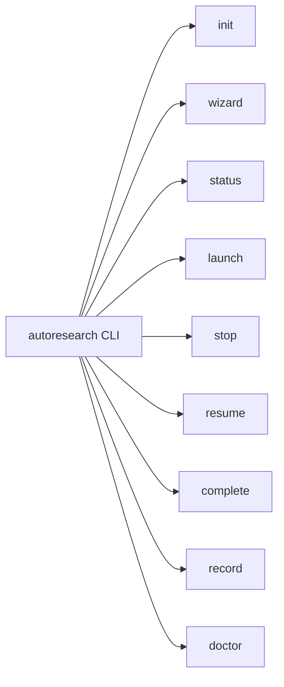
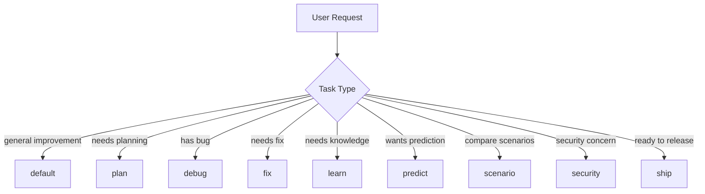
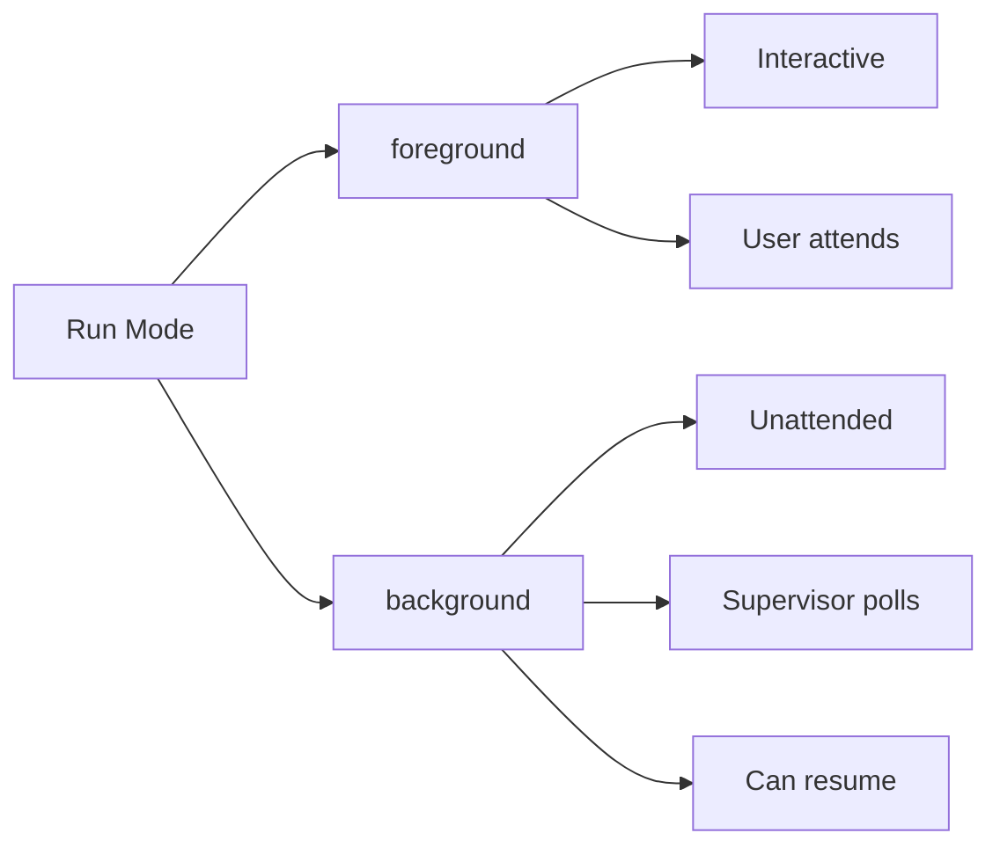

# Commands

## OpenCode Command Surface

The command family is fully supported in OpenCode:

```mermaid
flowchart TD
    A[/autoresearch] --> B[Default Loop]
    A --> C[Specialized Modes]
    C --> D[/autoresearch:plan]
    C --> E[/autoresearch:debug]
    C --> F[/autoresearch:fix]
    C --> G[/autoresearch:learn]
    C --> H[/autoresearch:predict]
    C --> I[/autoresearch:scenario]
    C --> J[/autoresearch:security]
    C --> K[/autoresearch:ship]
```

- `/autoresearch` — Default improve-verify loop
- `/autoresearch:plan` — Planning workflow
- `/autoresearch:debug` — Debugging workflow
- `/autoresearch:fix` — Fix workflow
- `/autoresearch:learn` — Learning workflow
- `/autoresearch:predict` — Prediction workflow
- `/autoresearch:scenario` — Scenario expansion
- `/autoresearch:security` — Security review
- `/autoresearch:ship` — Ship-readiness workflow

## Hermes Agent Command Surface

Hermes uses `cronjob` and `delegate_task` instead of slash commands:

| OpenCode Command | Hermes Equivalent |
|-----------------|-------------------|
| `/autoresearch` | Cron runs iteration loop |
| `/autoresearch:plan` | Subagent task: plan experiments |
| `/autoresearch:debug` | Subagent task: debug failures |
| `/autoresearch:fix` | Subagent task: fix issues |
| `/autoresearch:learn` | Memory tool + pattern analysis |
| `/autoresearch:predict` | Subagent task: predict outcomes |
| `/autoresearch:scenario` | Subagent task: expand scenarios |
| `/autoresearch:security` | Subagent task: security audit |
| `/autoresearch:ship` | Subagent task: ship checks |

| CLI Command | Hermes Equivalent |
|-------------|-------------------|
| `autoresearch init` | Manual setup (same CLI) |
| `autoresearch status` | `cat .autoresearch/state.json` |
| `autoresearch launch` | `hermes cron create` |
| `autoresearch stop` | `hermes cron pause` |
| `autoresearch resume` | `hermes cron resume` |

See [`skills/hermes/INTEGRATION.md`](https://github.com/Maleick/AutoResearch/blob/main/skills/hermes/INTEGRATION.md) for the full mapping.

## New in v3.3.0

- `/autoresearch` now supports **recursive self-improvement** via `meta_orchestrator` role
- Enhanced subagent pool with `pattern_analyst`, `strategy_advisor`, `regression_guard`
- Background runs now persist memory across meta-iterations

## New in v3.3.3

- **Hermes Agent support** — cron-based iteration loop with `delegate_task` subagents
- Dual-runtime documentation and command mapping

## New in v3.6.0

- **Score trend artifacts** — `.autoresearch/score-history.jsonl` logs each iteration's metric score
- `autoresearch scores` command — Export latest N score snapshots

### Score History Format

The score history is stored as JSON Lines (one JSON object per line):

```json
{"timestamp":"2026-05-08T10:30:00Z","iteration":1,"run_id":"run-abc123","decision":"keep","metric_value":"42","metric_name":"errors","metric_direction":"lower","verify_status":"pass","guard_status":"skip"}
```

| Field | Type | Description |
|-------|------|-------------|
| `timestamp` | string | ISO 8601 timestamp |
| `iteration` | number | Iteration number |
| `run_id` | string | Unique run identifier |
| `decision` | string | `keep`, `discard`, or `needs_human` |
| `metric_value` | number\|null | Numeric metric value |
| `metric_name` | string | Name of tracked metric |
| `metric_direction` | string | `lower` or `higher` (better direction) |
| `verify_status` | string | `pass`, `fail`, or `skip` |
| `guard_status` | string | `pass`, `fail`, or `skip` |

### Rotation Policy

- No automatic rotation — file grows indefinitely
- Manual cleanup: `tail -n 1000 .autoresearch/score-history.jsonl > tmp && mv tmp .autoresearch/score-history.jsonl`
- Or use `autoresearch scores --limit N` to display only the most recent N records

### CLI Command

- `autoresearch scores` — Show latest 10 score records (default)
- `autoresearch scores --limit N` — Show latest N scores
- `autoresearch scores --json` — Output as a JSON object with `count` and `scores`
- `autoresearch scores --score-history-path <path>` — Custom score history path

## CLI

The `autoresearch` CLI provides background and foreground run control:



- `autoresearch init` — Initialize a run
- `autoresearch wizard` — Generate setup summary
- `autoresearch status` — Print run status
- `autoresearch launch` — Launch background run
- `autoresearch stop` — Request stop
- `autoresearch resume` — Resume background run
- `autoresearch complete` — Mark run complete
- `autoresearch record` — Record iteration result
- `autoresearch doctor` — Verify installation

## Mode Routing



- **default**: Improve-verify loop with metric tracking
- **plan**: Setup planning before iteration
- **debug**: Debugging workflow
- **fix**: Targeted repair workflow
- **learn**: Knowledge acquisition
- **predict**: Outcome prediction
- **scenario**: Scenario comparison
- **security**: Security review
- **ship**: Ship-readiness check

## Background vs Foreground



| Mode | Use When |
| --- | --- |
| `foreground` | Interactive development, user present |
| `background` | Overnight runs, self-improvement, CI/CD |

Background runs create `.autoresearch/state.json` and can be resumed with `autoresearch resume` (OpenCode) or continue automatically (Hermes cron).
